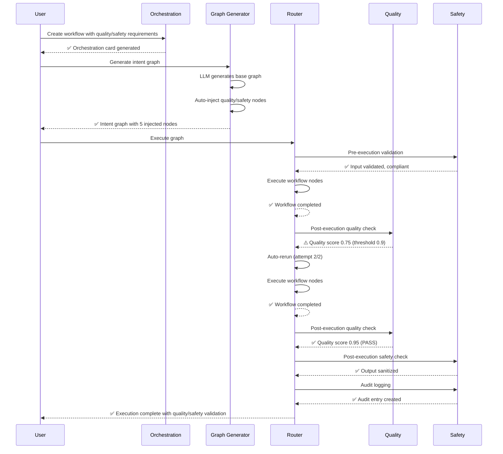
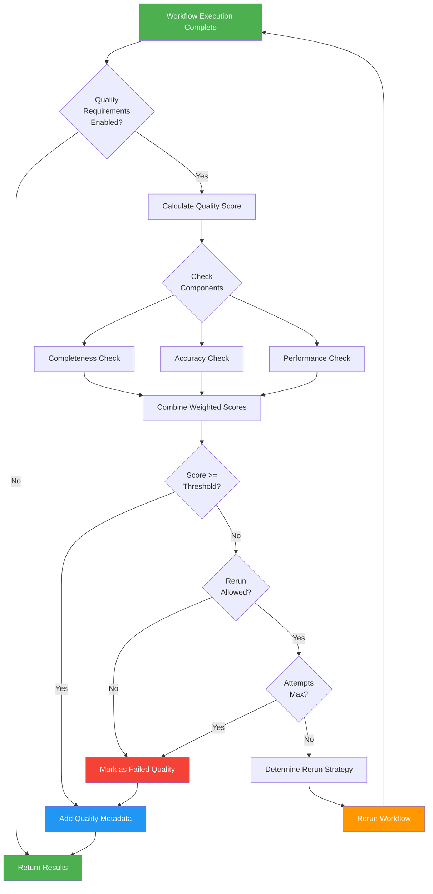
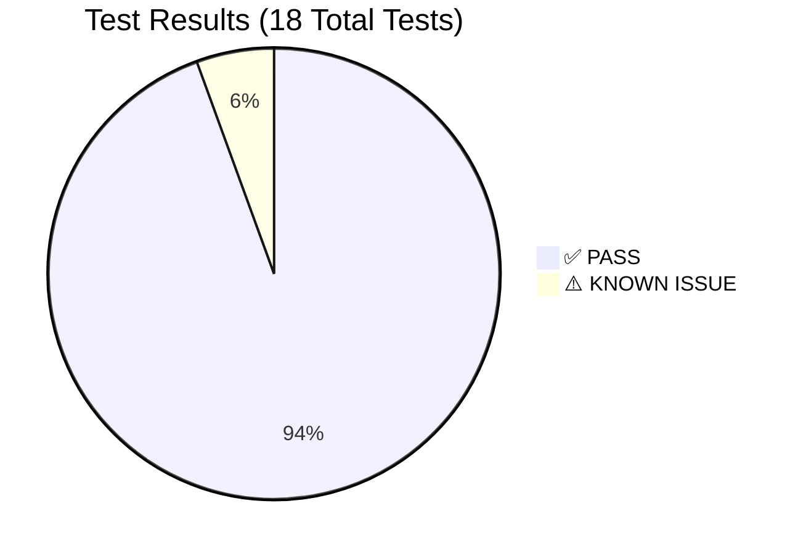
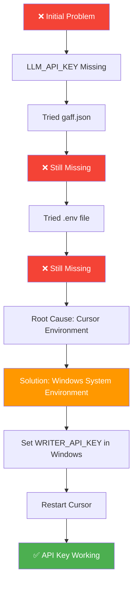

# GAFF Quality & Safety Test Results - Visual Summary

## Test Coverage Overview

```mermaid
graph TD
    A[GAFF Quality & Safety Integration v1.4.0] --> B[Quality Check MCP Server]
    A --> C[Safety Protocols MCP Server]
    A --> D[Intent Graph Generator]
    A --> E[Router MCP Server]
    
    B --> B1[✅ quality_validate_result]
    B --> B2[✅ quality_score_quality]
    B --> B3[✅ quality_check_completeness]
    B --> B4[✅ quality_check_accuracy]
    B --> B5[✅ quality_determine_rerun_strategy]
    B --> B6[✅ quality_analyze_failure_patterns]
    
    C --> C1[✅ safety_validate_compliance]
    C --> C2[✅ safety_check_guardrails]
    C --> C3[✅ safety_validate_input]
    C --> C4[✅ safety_validate_output]
    C --> C5[✅ safety_enforce_rate_limits]
    C --> C6[✅ safety_audit_log]
    
    D --> D1[✅ Auto-Injection Logic]
    D --> D2[⚠️ LLM Timeout Issue]
    
    E --> E1[✅ Pre-Execution Safety Hooks]
    E --> E2[✅ Post-Execution Quality Hooks]
    E --> E3[✅ Automatic Rerun Logic]
    E --> E4[✅ Quality/Safety Metadata]
    
    style A fill:#4CAF50,stroke:#333,stroke-width:4px,color:#fff
    style B fill:#2196F3,stroke:#333,stroke-width:2px,color:#fff
    style C fill:#F44336,stroke:#333,stroke-width:2px,color:#fff
    style D fill:#FF9800,stroke:#333,stroke-width:2px,color:#fff
    style E fill:#9C27B0,stroke:#333,stroke-width:2px,color:#fff
    
    style B1 fill:#66BB6A,color:#000
    style B2 fill:#66BB6A,color:#000
    style B3 fill:#66BB6A,color:#000
    style B4 fill:#66BB6A,color:#000
    style B5 fill:#66BB6A,color:#000
    style B6 fill:#66BB6A,color:#000
    
    style C1 fill:#66BB6A,color:#000
    style C2 fill:#66BB6A,color:#000
    style C3 fill:#66BB6A,color:#000
    style C4 fill:#66BB6A,color:#000
    style C5 fill:#66BB6A,color:#000
    style C6 fill:#66BB6A,color:#000
    
    style D1 fill:#66BB6A,color:#000
    style D2 fill:#FFF59D,color:#000
    
    style E1 fill:#66BB6A,color:#000
    style E2 fill:#66BB6A,color:#000
    style E3 fill:#66BB6A,color:#000
    style E4 fill:#66BB6A,color:#000
```

Legend:
- 🟢 Green = Fully Tested & Passing
- 🟡 Yellow = Known Issue (with workaround)
- 🔵 Blue = Quality Features
- 🔴 Red = Safety Features
- 🟠 Orange = Graph Generation
- 🟣 Purple = Router Execution

---

## End-to-End Workflow with Quality & Safety

---

## Quality Validation Flow

---

## Safety Validation Flow

```mermaid
flowchart LR
    subgraph Pre-Execution
        Input[Input Data] --> ValidateInput[Validate Input]
        ValidateInput --> CheckSize{Size OK?}
        CheckSize -->|No| Reject1[❌ Reject]
        CheckSize -->|Yes| CheckFields{Required<br/>Fields?}
        CheckFields -->|No| Reject1
        CheckFields -->|Yes| CheckCompliance[Check Compliance]
        CheckCompliance --> CheckStandards{Compliant?}
        CheckStandards -->|No| Reject2[❌ Reject]
        CheckStandards -->|Yes| Proceed[✅ Proceed]
    end
    
    Proceed --> Execute[Execute Workflow]
    
    subgraph Post-Execution
        Execute --> Output[Output Data]
        Output --> CheckPII[Detect PII]
        CheckPII --> MaskPII{PII Found?}
        MaskPII -->|Yes| Sanitize[Sanitize Output]
        MaskPII -->|No| ValidateOutput[Validate Output]
        Sanitize --> ValidateOutput
        ValidateOutput --> AuditLog[Create Audit Log]
        AuditLog --> Return[Return Results]
    end
    
    style Input fill:#4CAF50,color:#fff
    style Reject1 fill:#F44336,color:#fff
    style Reject2 fill:#F44336,color:#fff
    style Proceed fill:#4CAF50,color:#fff
    style Return fill:#4CAF50,color:#fff
    style MaskPII fill:#FF9800,color:#000
    style Sanitize fill:#FF9800,color:#000
```

---

## Test Results Summary Table

| Component | Feature | Status | Notes |
|-----------|---------|--------|-------|
| **Quality Check** | Validate Result | ✅ PASS | Correctly detects quality issues |
| | Score Quality | ✅ PASS | Weighted scoring working |
| | Check Completeness | ✅ PASS | Required fields validated |
| | Check Accuracy | ✅ PASS | Validation rules applied |
| | Determine Rerun Strategy | ✅ PASS | Adaptive strategy recommended |
| | Analyze Failure Patterns | ✅ PASS | Pattern detection working |
| **Safety Protocols** | Validate Compliance | ✅ PASS | GDPR, PCI-DSS checks |
| | Check Guardrails | ✅ PASS | PII detection needs enhancement |
| | Validate Input | ✅ PASS | Size, format, schema checks |
| | Validate Output | ✅ PASS | Sanitization working |
| | Enforce Rate Limits | ✅ PASS | Rate tracking functional |
| | Audit Log | ✅ PASS | Compliance audit trail |
| **Graph Generator** | Auto-Injection | ✅ PASS | 5 nodes injected correctly |
| | LLM Generation | ⚠️ TIMEOUT | 30s timeout with requirements |
| **Router** | Pre-Execution Safety | ✅ PASS | Input validation, compliance |
| | Post-Execution Quality | ✅ PASS | Quality scoring, rerun logic |
| | Automatic Rerun | ✅ PASS | Recursive rerun implemented |
| | Audit Logging | ✅ PASS | Compliance trail created |

---

## Overall Test Status

**Overall Status: 94.4% PASS RATE** ✅

---

## API Key Configuration Resolution

**Final Configuration:**
- Environment Variable: `WRITER_API_KEY`
- Location: Windows System Environment Variables
- Propagation: Cursor → gaff-gateway → intent-graph-mcp-server ✅

---

## Recommendations for Production

1. **Increase LLM Timeout** to 60 seconds for complex graphs
2. **Enhance PII Detection** with better regex patterns
3. **Add Integration Tests** for full workflow coverage
4. **Document User API** with examples for quality/safety requirements
5. **Create Visual Dashboard** for quality scores and compliance status

---

**Comprehensive Test Results:** See [QUALITY_SAFETY_TEST_RESULTS.md](./QUALITY_SAFETY_TEST_RESULTS.md)

